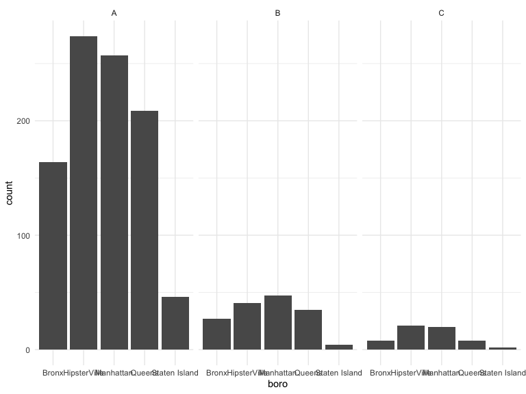

Midterm Project
================
Yue Liu
2020-10-31

## Restaurant inspection

``` r
api_url = "https://data.cityofnewyork.us/resource/43nn-pn8j.csv"

rest_inspection = 
  GET(api_url, query = list("$limit" = 50000)) %>% 
  content("parsed")
```

    ## Parsed with column specification:
    ## cols(
    ##   .default = col_character(),
    ##   camis = col_double(),
    ##   zipcode = col_double(),
    ##   inspection_date = col_datetime(format = ""),
    ##   score = col_double(),
    ##   grade_date = col_datetime(format = ""),
    ##   record_date = col_datetime(format = ""),
    ##   latitude = col_double(),
    ##   longitude = col_double(),
    ##   community_board = col_double(),
    ##   bin = col_double(),
    ##   bbl = col_double()
    ## )

    ## See spec(...) for full column specifications.

``` r
rest_inspection %>% 
  count(boro, grade) %>% 
  pivot_wider(names_from = grade, values_from = n)
```

    ## # A tibble: 6 x 9
    ##   boro              A     C  `NA`     B     N     P     Z     G
    ##   <chr>         <int> <int> <int> <int> <int> <int> <int> <int>
    ## 1 0                17     5    14    NA    NA    NA    NA    NA
    ## 2 Bronx          1802   120  2191   321    21    31    13    NA
    ## 3 Brooklyn       5039   288  6419   837    74   121    37     1
    ## 4 Manhattan      7784   481  9777  1234   138   117    57    NA
    ## 5 Queens         4563   294  5581   728    85    76    66    NA
    ## 6 Staten Island   703    35   796   106    15    10     3    NA

``` r
rest_inspection =  
  rest_inspection %>% 
  filter(grade %in% c("A", "B", "C"), boro != "0")
```

Let’s look at pizza places.

``` r
rest_inspection %>% 
  mutate(dba = str_to_upper(dba)) %>% 
  filter(str_detect(dba, "PIZZA")) %>% View()
```

``` r
rest_inspection %>% 
  mutate(dba = str_to_upper(dba)) %>% 
  filter(str_detect(dba, "PIZZA")) %>% 
  count(boro, grade) %>% 
  pivot_wider(names_from = grade, values_from = n)
```

    ## # A tibble: 5 x 4
    ##   boro              A     B     C
    ##   <chr>         <int> <int> <int>
    ## 1 Bronx           164    27     8
    ## 2 Brooklyn        274    41    21
    ## 3 Manhattan       257    47    20
    ## 4 Queens          209    35     8
    ## 5 Staten Island    46     4     2

``` r
rest_inspection %>% 
  mutate(dba = str_to_upper(dba)) %>% 
  filter(str_detect(dba, "PIZZA")) %>% 
  #mutate(boro = fct_relevel(boro, "Manhattan")) %>% 
  mutate(boro = fct_infreq(boro),
         boro =  str_replace(boro, "Brooklyn", "HipsterVille")) %>% 
  # the order  will change 
  ggplot(aes(x = boro)) + 
  geom_bar() +
  facet_wrap(. ~ grade)
```



## Napoleon Dynamite

Get some Napolen Dynamite
reviews

``` r
nap_dyn_url = "https://www.amazon.com/product-reviews/B00005JNBQ/ref=cm_cr_arp_d_viewopt_rvwer?ie=UTF8&reviewerType=avp_only_reviews&sortBy=recent&pageNumber=1"

napoleon_html  = read_html(nap_dyn_url)

review_titles = 
  napoleon_html %>% 
  html_nodes(".a-text-bold span") %>% 
  html_text()

review_text = 
  napoleon_html %>% 
  html_nodes(".review-text-content span") %>% 
  html_text()

nap_df =
  tibble(
    titles = review_titles,
    text =  review_text
    )
```
